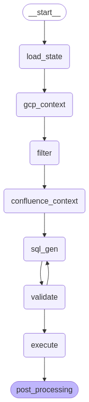

# Data Agent

## Execution Graph
Execution of the agent is defined by a LangGraph StateGraph.

## Schemas

Responses and Context for every node in the graph and every LLM API call is defined by a pydantic model.

Shared Context through each node in the agent is defined by the DataAgentContext Schema. 
i.e every node has the type signature:  DataAgentContext -> DataAgentContext

LLM Assistants will always return structured JSON with the response defined by a pydantic model.

